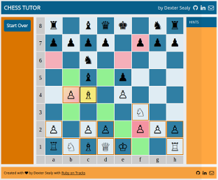
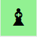
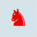

# Chess Tutor

Chess Tutor [(Live)](http://chess.dextersealy.com) is a single-page web application that teaches novices how to play chess.
While you play against the computer it shows you:
- your available moves
- threats to your pieces
- which of your moves are safe and which are not safe

Chess Tutor's [back-end](#back-end) runs atop the lightweight [Ruby on Tracks](https://github.com/dextersealy/ruby-on-tracks) controller/view framework. The [front-end](#front-end) is plain JavaScript with jQuery. The [AI](#computerplayer) utilizes a depth-first, minmax search to a depth of 3, and leverages a Ruby C [extension library](#chessutil) to evaluate ~9,000 moves per second.

## Contents

- [Playing the Game](#playing-the-game)
- [Design](#design)
  - [State](#state)
  - [Front-end](#front-end)
  - [Back-end](#back-end)
- [Implementation](#implementation)
  - [Routes](#routes)
  - [Controller](#controller)
  - [Game](#game)
  - [Board](#board)
  - [Piece](#piece)
  - [Player](#player)
  - [ComputerPlayer](#computerplayer)
  - [C Extension Library](#chessutil)
- [License](#license)

## Playing the Game

The first time you visit the site, it starts a new game and stores a compact copy in a browser cookie. When you revisit the site, you can pickup where you left off, or start a new game.



You play White and the computer plays Black. When it's your turn to make a move the game displays the following indicators:

Indicator|Description|Indicator|Description
---|---|---|---
|It draws a thick border around pieces you can move||When one of your moveable pieces is threatened (i.e., it can be captured by the opponent's next move) it adds a gradient background.
|When one of your threatened pieces can't move, it adds a solid background.

When you mouse over a moveable piece the game highlights valid moves:

Indicator|Description|Indicator|Description
---|---|---|---
|Green means the move is safe; the square is not threatened by any opposing piece.||Pink means the move is not safe; the square is threatened by an opposing piece.
|When you mouse over a threatened piece or move, it flashes the opposing pieces that pose a threat.

## Design

### State
[Back to top](#chess-tutor)

The first time you visit the site, it starts a new game and saves a compact representation in a browser cookie. This cookie requires fewer than 300 characters for a typical 40-move game. It uses a pseudo-[FEN](https://en.wikipedia.org/wiki/Forsyth%E2%80%93Edwards_Notation) notation to represent the game board and uses a similarly compact notation to record all the moves made by both players.

### Front-end
[Back to top](#chess-tutor)

The front-end's only concern is rendering; it contains no knowledge of chess and could be adapted to other board games.

When the back-end renders the board it assigns a unique ID to each square (e.g., "e1", "h7"). The front-end submits AJAX requests to get the player's moves and threats, and the back-end returns the information coded to each square's unique ID.

The front-end toggles class attributes on the affected squares, and CSS handles the rest.

### Back-end
[Back to top](#chess-tutor)

The back-end implements a RESTful API with the following entry points:

- **POST /new**
Resets the board to starting positions and returns the board state (see below).

- **GET /show**
  Returns a JSON object with the current board state. It lists the captured pieces and the locations of the active pieces. Pieces are represented by their [Unicode chess symbols](https://en.wikipedia.org/wiki/Chess_symbols_in_Unicode).
  ```
  {
    captured: {
      white: [ ],
      black: [ ]
      },
      active: {
        a8: "&#9820;",
        c8: "&#9821;",
        d8: "&#9819;",
        e8: "&#9818;",
        ...
      }
    }
    ```

- **GET /moves**
Returns a JSON object detailing the current player's moves and threats.
Each key is the position of one the player's pieces. The values are where it can move. For example, in the following snippet, the piece on **b4** can move to **b5** or **c5**.
  ```
  player: {
    b4: [
      "b5",
      "c5"
    ],
    c4: [
      "b5",
      "a6",
      ...
    ],
    e4: [ ],
    ...
  }
  ```
  For threats, the keys are the *threatened* squares and the values are the *threatening* squares. In this snippet, the square **e6** is threatened by opposing pieces on **d7** and **f7**.
  ```
  threats: {
    a6: [
      "b7"
    ],
    e6: [
      "d7",
      "f7"
    ],
    ...
  }
  ```

- **POST /move {from:** *loc1*, **to:** *loc2* **}**
Execute the human player's move. The back-end moves the piece from *loc1* to *loc2*, updates the cookie and returns the new board.

- **GET /move**
Execute the computer player's move; the back-end calculates the next move (this can take several seconds); updates the cookie, and returns the move and new board state:
  ```
  {
    from: "b8",
    to: "c6",
    board: {
      captured: {
        ...
      },
      active: {
        ...
      }
    }
  }
  ```
## Implementation
[Back to top](#chess-tutor)

Chess Tutor's runs atop the lightweight [Ruby on Tracks](https://github.com/dextersealy/ruby-on-tracks) back-end framework, with  one small adaptation; the server accepts a board as a command line parameter so that during development you can bypass intermediate play and jump directly to a specific state.

The file ```chess_server.rb``` is the main entry point. It parses the command line, maps the application's routes, then builds and starts the Rack server.

### Routes
[Back to top](#chess-tutor)

```ruby
router = Router.new
router.draw do
  get Regexp.new("^/$"), ChessController, :init
  post Regexp.new("^/new$"), ChessController, :new
  get Regexp.new("^/show$"), ChessController, :show
  get Regexp.new("^/moves$"), ChessController, :moves
  post Regexp.new("^/move$"), ChessController, :move
  get Regexp.new("^/move$"), ChessController, :make_move
end
```

### Controller
[Back to top](#chess-tutor)

**ChessController** in ```chess_controller.rb``` implements the back-end actions.

When a request arrives, the router creates a new controller instance. The controller instantiates  **Game**, **Player**  and **ComputerPlayer** objects as needed, and performs the action. When the response is complete an ```after_action``` saves the new game state in the user's session.

### Game
[Back to top](#chess-tutor)

The **Game** class implements the high-level game interface. It mostly delegates to the **Board** class, but has the important responsibility of tracking who is the current player (i.e., White or Black).

### Board
[Back to top](#chess-tutor)

The **Board** tracks pieces and moves. It implements the logic for castling and pawn promotion, but otherwise delegates chess knowledge to **Piece** and its descendants.

Pieces are stored internally in a flat list. They can be indexed using [*row*, *column*] coordinates, but this is rarely used outside the class because it incorporates the **Enumerable** mixin to facilitate iteration.

The major methods are:
- ```#move_piece``` movse a piece
- ```#undo_move``` reverses a move
- ```#state``` returns the encoded board state
- ```#captured``` returns the captured pieces on both sides
- ```#in_check?``` tests whether a color is in check

### Piece
[Back to top](#chess-tutor)

**Piece** is the base class for chess pieces; a piece knows its color and board position.

`#valid_moves` returns the places where the piece can move. Internally, Piece calls its descendant's `#moves` method and rejects moves that would place/leave the player in check:

```ruby
def valid_move?(end_pos)
  board.move_piece(current_pos, end_pos)
  result = !board.in_check?(color)
  board.undo_move
  result
end
```

The **King** class overrides `#valid_moves` to account for its unique behaviors. The other descendants implement ```#moves``` and rely on Piece to handle validation.

### Player
[Back to top](#chess-tutor)

**Player** has a color and holds a reference to the Game:

- `#valid_moves` aggregates and returns the player's pieces' valid moves
- `#threats` returns threats to the player's pieces
- `#move_threats` returns threats to each potential move

### ComputerPlayer
[Back to top](#chess-tutor)

**ComputerPlayer** calculates chess moves.

`#get_move` implements a depth-first [minmax](https://chessprogramming.wikispaces.com/Minimax) search with Alpha-Beta pruning to a depth of 3.

```ruby
def minmax(max_depth, depth = 0, alpha = -100000, beta = 100000,
  maximizing = true)
  return nil, board_value if depth >= max_depth

  best_move = nil;
  best_value = maximizing ? -99999 : 99999
  player = maximizing ? self.color : opposite(self.color)

  each_move(player) do |move|
    board.move_piece(*move)
    _, value = minmax(max_depth, depth + 1, alpha, beta, !maximizing)
    board.undo_move

    if maximizing
      best_move = move if value > best_value
      best_value = value if value > best_value
      alpha = best_value if best_value > alpha
    else
      best_move = move if value < best_value
      best_value = value if value < best_value
      beta = best_value if beta < best_value
    end

    break if beta <= alpha
  end
  return best_move, best_value
end
```

The branching factor in chess is around 40 and on its turn **ComputerPlayer** may have to evaluate upwards of 64,000 moves. For better performance, it uses an extension library written in C and can evaluate ~9,000 moves per second.

### ChessUtil
[Back to top](#chess-tutor)

**ChessUtil** is an Ruby C extension library that generates moves and evaluates boards. Ruby is a fast language for developing code, and a slow language for executing code. ChessUtil implements the most heavily used operations in C so that Chess Tutor can perform the millions of required calculations in reasonable time.

- `#in_bounds` tests if a position falls within the 8x8 board coordinates
- `#moves_include` tests if an array of moves includes a position
- `#get_piece_at` returns the piece on the board
- `#set_piece_at` places a piece on the board
- `#get_moves` generates moves for a sliding piece (i.e., Bishop, Rook and Queen)
- `#get_pawn_moves` generates moves for a Pawn
- `#get_knight_moves` generates moves for a Knight
- `#get_king_moves` generates moves for a King
- `#get_board_value` calculates the value of a board

## License
[Back to top](#chess-tutor)

Chess Tutor Copyright (c) Dexter Sealy

Chess Tutor is free software; you can distribute it and/or modify it subject to the terms of the [MIT license](https://opensource.org/licenses/MIT).
