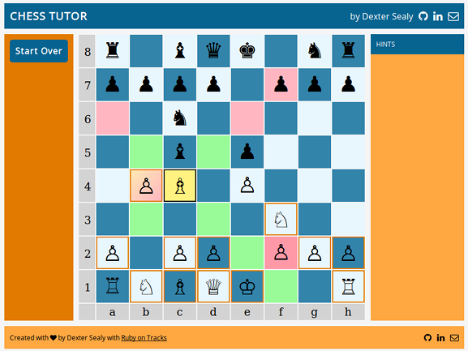

# Chess Tutor

Chess Tutor is a single-page web application that teaches novices how to play chess.
While you play against the computer it shows you:
- your available moves
- threats to your pieces
- which of your moves are safe and not safe

Chess Tutor's back-end runs atop the lightweight [Ruby on Tracks](https://github.com/dextersealy/ruby-on-tracks) controller/view framework. The front-end is plain JavaScript with jQuery.

## Playing the Game

The first time you visit the site, it starts a new game and stores a compact copy in a browser cookie. When you revisit the site, you can pickup where you left off, or start a new game.



You play White and the computer plays Black. When it's your turn it displays the following indicators:

Indicator|Description|Indicator|Description
---|---|---|---
|It draws a thick border around pieces you can move||When one of your moveable pieces is threatened (i.e., it can be captured by the computer's next move) it adds a gradient background.
|When one of your threatened pieces can't move, it draws it with a solid background.

When you mouse over a piece the application highlights valid moves:

Indicator|Description|Indicator|Description
---|---|---|---
|Pink means the move is not safe; the square is threatened by a Black piece.||Green means the move is safe; the square is not threatened by any Black pieces.
|And when you mouse over a threatened piece or move, it flashes the Black pieces that pose a threat.

## Design

### Session cookie

The first time you visit the site, it starts a new game and saves a compact representation in a browser cookie. This cookie requires fewer than 300 characters for a typical 40-move game. It uses a pseudo-[FEN](https://en.wikipedia.org/wiki/Forsyth%E2%80%93Edwards_Notation) notation to represent the game board and uses a similarly compact notation to record all the moves made by both players.

### Front-end

The front-end's only concern is rendering; it contains no knowledge of chess and could be adapted to other board games.

When the back-end renders the board it assigns a unique ID to each square (e.g., "e1", "h7"). To display moves and threats, the front-end submits an AJAX request and the back-end returns the information coded to each square's unique ID.

The front-end then toggles the class attributes of the affected squares, and CSS does the rest.

### RESTful API

The back-end API has the following entry points:

- **POST /new**
Resets the cookie to starting positions and returns a JSON object listing the captured pieces and the locations of the active pieces.
  ```
  {
    captured: {
      white: [ ],
      black: [ ]
    },
    active: {
      a8: "&#9820;",
      c8: "&#9821;",
      d8: "&#9819;",
      e8: "&#9818;",
      ...
    }
  }
  ```

- **GET /show**
  Returns JSON object with the current board state (see above).
- **GET /moves**
Returns a JSON object detailing the current player's moves and threats.
Each key is the position of one the player's pieces. The values are where it can move. For example, in the following snippet, the piece on **b4** can move to **b5** or **c5**.
  ```
  player: {
    b4: [
      "b5",
      "c5"
    ],
    c4: [
      "b5",
      "a6",
      ...
    ],
    e4: [ ],
    ...
  }
  ```
  For threats, the keys are the *threatened* squares and the values are the *threatening* squares. In this snippet, the square **e6** is threatened by opposing pieces on **d7** and **f7**.
  ```
  threats: {
    a6: [
      "b7"
    ],
    e6: [
      "d7",
      "f7"
    ],
    ...
  }
  ```
- **POST /move {from:** *loc1*, **to:** *loc2* **}**
Execute the human player's move; moves the piece at board location *loc1* to *loc2*, updates the cookie, and returns the board state.

- **GET /move**
Execute the computer player's move; calculates the next move (this can take several seconds); updates the cookie, and returns the move and new board state:
  ```
  {
    from: "b8",
    to: "c6",
    board: {
      captured: {
        ...
      },
      active: {
        ...
      }
    }
  }
  ```
## Implementation

Chess Tutor's runs atop the lightweight [Ruby on Tracks](https://github.com/dextersealy/ruby-on-tracks) back-end framework, with only one small adaptation; the server is accepts a board as a command line parameter so that during development you can bypass intermediate play and jump directly to a specific board state.

The file ```chess_server.rb``` is the main entry point. It parse the command line, maps the application's routes, then builds and starts the Rack server.

### Routes

```ruby
router = Router.new
router.draw do
  get Regexp.new("^/$"), ChessController, :init
  post Regexp.new("^/new$"), ChessController, :new
  get Regexp.new("^/show$"), ChessController, :show
  get Regexp.new("^/moves$"), ChessController, :moves
  post Regexp.new("^/move$"), ChessController, :move
  get Regexp.new("^/move$"), ChessController, :make_move
end
```

### Controller

The ChessController class in ```chess_controller.rb``` implements the back-end actions.

When new request arrives, the router creates a new controller instance. The controller instantiates a new **Game** instance, performs the action then saves the new game state within an ```after_action```. It uses the  **ComputerPlayer** class to calculate chess moves.

### Game

The Game class implements the high-level game interface. It mostly delegates to the **Board** class, but has the important responsibility of tracking who is the current player (i.e., White or Black).

### Board

The **Board** class tracks chess pieces and chess moves. Pieces are accessed via [row, column] coordinates but are stored internally in a flat list. The **Enumerable** mixin  facilitates iteration over pieces. ```Board#move_piece``` moves a piece and ```#undo_move``` reverses a move.


Board implements the logic for castling and pawn promotion, and otherwise delegates chess knowledge to **Piece** and its descendants.
